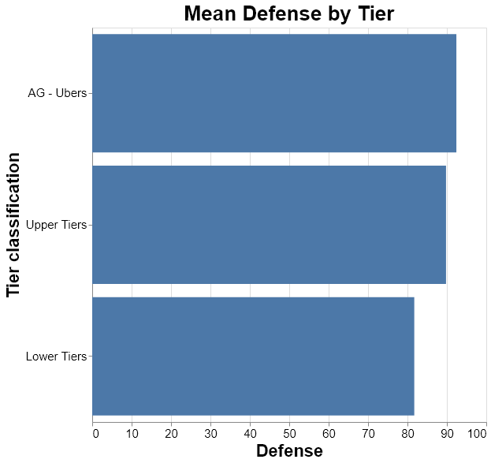
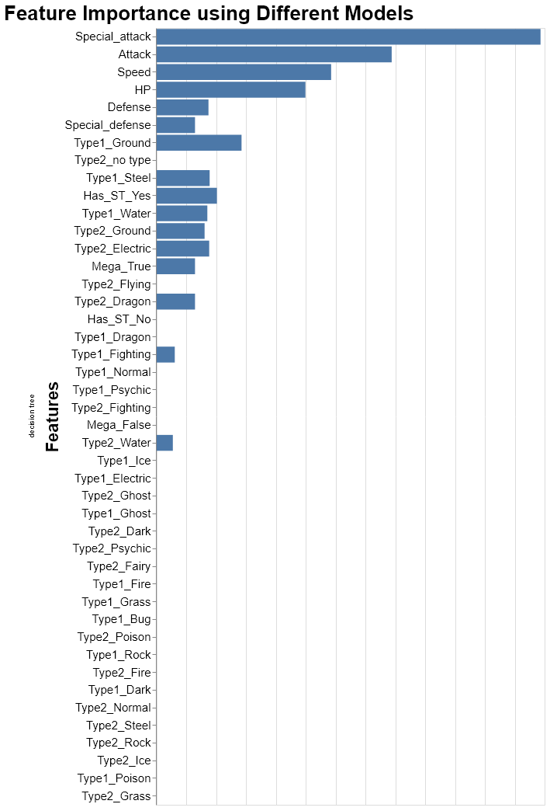
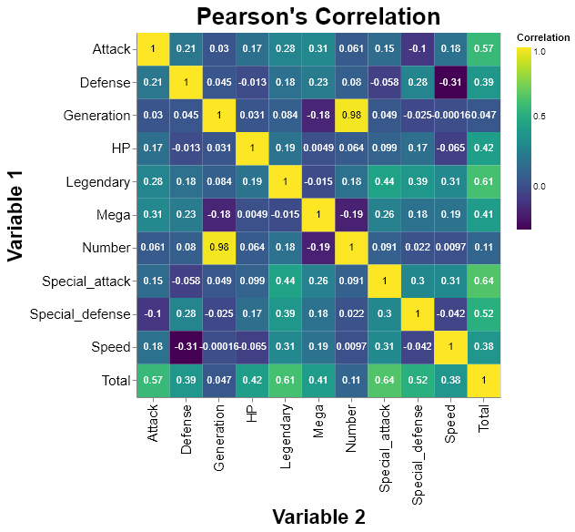
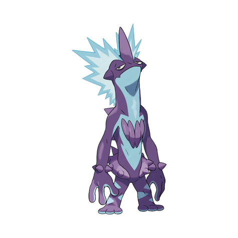

Pokemon Tier Prediction
================
Andrés Pitta  
2020/01/25 (updated: 2020-05-02)

  - [Summary](#summary)
  - [Methods](#methods)
      - [Data](#data)
      - [Analysis](#analysis)
          - [EDA](#eda)
          - [Modeling](#modeling)
          - [Final Test](#final-test)
  - [Reflection and Further work](#reflection-and-further-work)
  - [References](#references)

# Summary

One of my favorite games was released in November 15, Pokemón [Sword and
Shield](https://swordshield.pokemon.com/en-us/). And one of my biggest
interest is to set a Pokemón team that is both cute and can be used to
compete with my friends and my partner. As a result, and just for
funsies, I decided to create a classification model that can help me
predict the tier of the Pokemón I am going to choose for my team.

For those of you who do not know what a tier is, do not worry, I have
your back. [Smogon](https://www.smogon.com/), one of the most important
Pokemón analysis community, has set up a tier system to classify how
competitive a Pokemón is. The highest tier is Uber, which is basically a
list oh too-op-to-handle Pokemón. The lowest tier is called **NU** and
it stands for **NEVER USED** (but every Pokemón is important in my
heart). If you are interested,
[here](https://www.smogon.com/bw/articles/bw_tiers) is a link you can
read.

For this project, I grouped the tiers like this:

| Grouped Tier | Tier         |
| ------------ | ------------ |
| AG           | AG and Ubers |
| Uber         | AG and Ubers |
| OU           | Upper tiers  |
| BL           | Upper tiers  |
| UU           | Upper tiers  |
| BL2          | Lower tiers  |
| RU           | Lower tiers  |
| BL3          | Lower tiers  |
| NU           | Lower tiers  |
| BL4          | Lower tiers  |
| PU           | Lower tiers  |

Now that we know what this project is about, let’s see the process:

# Methods

## Data

The data set used in this project is “Pokemón 6v6 competitive” created
by Gibs. It was collected from Kaggle.com (Gibs 2016) and can be found
[here](https://www.kaggle.com/notgibs/smogon-6v6-pokemon-tiers). This
dataset contains approximately 500 Pokemón, with the following features:

  - 10 categorical features:
      - Name
      - Primary Type
      - Secondary Type
      - Generation
      - Legendary (Binary variable that labels legendary Pokemón)
      - Mega (Binary variable that labels Pokemón with Mega Evolution)
  - 2 continuous features (All of them are stats measured from 0, which
    is the worst, to 600):
      - Attack
      - Special Attack
      - Defense
      - Special Defense
      - HP
      - Speed
      - Total
  - Response:
      - Tier

## Analysis

The R and Python programming languages (R Core Team 2019; Van Rossum and
Drake 2009) and the following R and Python packages were used to perform
the analysis: docopt (de Jonge 2018), knitr (Xie 2014), tidyverse
(Wickham et al. 2019), readr (Wickham, Hester, and Francois 2018) docopt
(Keleshev 2014), altair (VanderPlas et al. 2018), selenium (SeleniumHQ
2020), pandas (McKinney 2010), numpy (Oliphant 2006), statsmodel
(Seabold and Perktold 2010). scikit-learn (Buitinck et al. 2013).

The code used to perform the analysis and create this report can be
found [here](https://github.com/AndresPitta/P01_Pokemon-tier)

For this model, the following models were tested:

<table class="table" style="width: auto !important; margin-left: auto; margin-right: auto;">

<thead>

<tr>

<th style="text-align:left;">

Model

</th>

</tr>

</thead>

<tbody>

<tr>

<td style="text-align:left;">

decision tree

</td>

</tr>

<tr>

<td style="text-align:left;">

kNN

</td>

</tr>

<tr>

<td style="text-align:left;">

OVR - logistic regression

</td>

</tr>

<tr>

<td style="text-align:left;">

OVR - RBF SVM

</td>

</tr>

<tr>

<td style="text-align:left;">

OVO - logistic regression

</td>

</tr>

<tr>

<td style="text-align:left;">

OVO - RBF SVM

</td>

</tr>

<tr>

<td style="text-align:left;">

random forest

</td>

</tr>

<tr>

<td style="text-align:left;">

xgboost

</td>

</tr>

<tr>

<td style="text-align:left;">

lgbm

</td>

</tr>

<tr>

<td style="text-align:left;">

Dummy

</td>

</tr>

</tbody>

</table>

As mentioned, all of this classification models were aiming to predict
the tier divided in 3 categories: AG and Ubers, Upper Tiers, and Lower
Tiers. But before modeling, Let’s analyze the variables to see which
ones are the most important.

### EDA

For this EDA, I plotted the variables against the 3 main groups. All of
the plots were stored
[here](https://github.com/AndresPitta/P01_Pokemon-tier/tree/master/results/figures).
But let’s see a few examples:

Image 1 - Average Attack by Tier

As you can see, the average attack of the higher tiers is 130, compared
to an average of 80 in the lower tiers. Naturally, I can see why Pokemón
players lean towards pokemon that hit harder. However, this behavior
cannot be extended to the defense, where the difference between higher
tiers and lower tiers is roughly 10 points.

Image 2 - Average Defense by Tier

Now we see a pattern here.

Then, in order to have an understanding of the importance of the
variables, I decided to run a tree to check the `feature_importance_`:

Image 3 - Feature Importance using a Decision Tree

Finally, I also made a correlation matrix to understand a little bit
more the Pokemón:

Image 4 - Feature’s Correlation Matrix

From which you can see that, for instance, Pokemón with higher defense
have a lower speed. It seems like people do not like to wait be hit.
From my personal experience, I guess having 1 or 2 defensive Pokemón is
enough. I am now starting to realize why I loose so much.

### Modeling

As I mentioned before, 10 models were tested before over a training set
of 424 Pókemon. Later, the final model was tested on a data set of 75
Pokemón. For the first portion, here are the results:

<table class="table" style="width: auto !important; margin-left: auto; margin-right: auto;">

<thead>

<tr>

<th style="text-align:left;">

Model

</th>

<th style="text-align:right;">

Train Accuracy

</th>

<th style="text-align:right;">

Validation Accuracy

</th>

<th style="text-align:right;">

Time in seconds

</th>

</tr>

</thead>

<tbody>

<tr>

<td style="text-align:left;">

decision tree

</td>

<td style="text-align:right;">

1.000

</td>

<td style="text-align:right;">

0.720

</td>

<td style="text-align:right;">

0.0300

</td>

</tr>

<tr>

<td style="text-align:left;">

kNN

</td>

<td style="text-align:right;">

0.742

</td>

<td style="text-align:right;">

0.723

</td>

<td style="text-align:right;">

0.0660

</td>

</tr>

<tr>

<td style="text-align:left;">

OVR - logistic regression

</td>

<td style="text-align:right;">

0.773

</td>

<td style="text-align:right;">

0.693

</td>

<td style="text-align:right;">

0.0590

</td>

</tr>

<tr>

<td style="text-align:left;">

OVR - RBF SVM

</td>

<td style="text-align:right;">

0.883

</td>

<td style="text-align:right;">

0.672

</td>

<td style="text-align:right;">

0.0382

</td>

</tr>

<tr>

<td style="text-align:left;">

OVO - logistic regression

</td>

<td style="text-align:right;">

0.797

</td>

<td style="text-align:right;">

0.696

</td>

<td style="text-align:right;">

0.0397

</td>

</tr>

<tr>

<td style="text-align:left;">

OVO - RBF SVM

</td>

<td style="text-align:right;">

0.852

</td>

<td style="text-align:right;">

0.659

</td>

<td style="text-align:right;">

0.0270

</td>

</tr>

<tr>

<td style="text-align:left;">

random forest

</td>

<td style="text-align:right;">

0.945

</td>

<td style="text-align:right;">

0.709

</td>

<td style="text-align:right;">

0.0460

</td>

</tr>

<tr>

<td style="text-align:left;">

xgboost

</td>

<td style="text-align:right;">

0.953

</td>

<td style="text-align:right;">

0.720

</td>

<td style="text-align:right;">

0.0270

</td>

</tr>

<tr>

<td style="text-align:left;">

lgbm

</td>

<td style="text-align:right;">

0.805

</td>

<td style="text-align:right;">

0.682

</td>

<td style="text-align:right;">

0.0320

</td>

</tr>

<tr>

<td style="text-align:left;">

Dummy

</td>

<td style="text-align:right;">

0.477

</td>

<td style="text-align:right;">

0.520

</td>

<td style="text-align:right;">

0.0230

</td>

</tr>

</tbody>

</table>

It is worth to mention that the variables that I choose (after
evaluating the feature importance) for the model were:

  - Attack
      - Special Attack
      - Defense
      - Special Defense
      - HP
      - Speed
      - Has Secondary Type

However, as you can see, all of the models seem to be a bit overfitted.
This led me to the decision of choosing a OVO - logistic regression. Now
let’s see how good this model is in the testing data set.

<table class="table" style="width: auto !important; margin-left: auto; margin-right: auto;">

<thead>

<tr>

<th style="text-align:right;">

X1

</th>

<th style="text-align:left;">

Model

</th>

<th style="text-align:right;">

Train accuracy

</th>

<th style="text-align:right;">

Test accuracy

</th>

</tr>

</thead>

<tbody>

<tr>

<td style="text-align:right;">

0

</td>

<td style="text-align:left;">

OVO - logistic regression

</td>

<td style="text-align:right;">

0.797

</td>

<td style="text-align:right;">

0.68

</td>

</tr>

</tbody>

</table>

So I guess a test accuracy of 0.68 is decent. I am not feeling super
confident right here. Let’s see the confusion matrix (Real on the rows,
predicted on the columns):

<table class="table" style="width: auto !important; margin-left: auto; margin-right: auto;">

<thead>

<tr>

<th style="text-align:left;">

</th>

<th style="text-align:right;">

AG - Ubers

</th>

<th style="text-align:right;">

Upper Tiers

</th>

<th style="text-align:right;">

Lower Tiers

</th>

</tr>

</thead>

<tbody>

<tr>

<td style="text-align:left;">

AG - Ubers

</td>

<td style="text-align:right;">

4

</td>

<td style="text-align:right;">

1

</td>

<td style="text-align:right;">

2

</td>

</tr>

<tr>

<td style="text-align:left;">

Upper Tiers

</td>

<td style="text-align:right;">

5

</td>

<td style="text-align:right;">

8

</td>

<td style="text-align:right;">

8

</td>

</tr>

<tr>

<td style="text-align:left;">

Lower Tiers

</td>

<td style="text-align:right;">

0

</td>

<td style="text-align:right;">

8

</td>

<td style="text-align:right;">

39

</td>

</tr>

</tbody>

</table>

And as you can see, at least the biggest numbers are in the correct
prediction (though it can improve much more). One of the main reasons
might be the small amount of data in the upper tiers. Even though I
tried balancing the data, maybe using oversampling techniques would have
helped. **Note:** In the code you can see I used balancing techniques.
They seem to not be enough for this one.

### Final Test

So given that I wanted to create a model to build a good team, let’s
evaluate the model with some of the team’s Pokemón. Just as an
annoucement, the pictures were taken from [pokemon.com](www.pokemon.com)

**First off is
[Polteageist](https://www.pokemon.com/es/pokedex/polteageist) :**

<table class="table" style="width: auto !important; margin-left: auto; margin-right: auto;">

<thead>

<tr>

<th style="text-align:left;">

Name

</th>

<th style="text-align:left;">

Type1

</th>

<th style="text-align:left;">

Type2

</th>

<th style="text-align:right;">

HP

</th>

<th style="text-align:right;">

Attack

</th>

<th style="text-align:right;">

Defense

</th>

<th style="text-align:right;">

Special\_attack

</th>

<th style="text-align:right;">

Special\_defense

</th>

<th style="text-align:right;">

Speed

</th>

</tr>

</thead>

<tbody>

<tr>

<td style="text-align:left;">

Polteageis

</td>

<td style="text-align:left;">

Ghost

</td>

<td style="text-align:left;">

NA

</td>

<td style="text-align:right;">

60

</td>

<td style="text-align:right;">

65

</td>

<td style="text-align:right;">

65

</td>

<td style="text-align:right;">

134

</td>

<td style="text-align:right;">

114

</td>

<td style="text-align:right;">

70

</td>

</tr>

</tbody>

</table>

Look at this cutie-pie. Ghost types are my favourite Pokemón, so I
needed one for my team. According to my model, Polteageist is going to
be Lower Tiers. **I’m heartbroken**.

**Second is
[Toxtricity](https://www.pokemon.com/el/pokedex/toxtricity):**

<table class="table" style="width: auto !important; margin-left: auto; margin-right: auto;">

<thead>

<tr>

<th style="text-align:left;">

Name

</th>

<th style="text-align:left;">

Type1

</th>

<th style="text-align:left;">

Type2

</th>

<th style="text-align:right;">

HP

</th>

<th style="text-align:right;">

Attack

</th>

<th style="text-align:right;">

Defense

</th>

<th style="text-align:right;">

Special\_attack

</th>

<th style="text-align:right;">

Special\_defense

</th>

<th style="text-align:right;">

Speed

</th>

</tr>

</thead>

<tbody>

<tr>

<td style="text-align:left;">

Toxtricity

</td>

<td style="text-align:left;">

Electric

</td>

<td style="text-align:left;">

Poison

</td>

<td style="text-align:right;">

75

</td>

<td style="text-align:right;">

98

</td>

<td style="text-align:right;">

70

</td>

<td style="text-align:right;">

114

</td>

<td style="text-align:right;">

70

</td>

<td style="text-align:right;">

75

</td>

</tr>

</tbody>

</table>

According to my model, This bad-ass is going to be Upper Tiers. This is
a cool addition to my team and it has a Gigamax form.

**Third is [Inteleon](https://www.pokemon.com/el/pokedex/inteleon):**

<table class="table" style="width: auto !important; margin-left: auto; margin-right: auto;">

<thead>

<tr>

<th style="text-align:left;">

Name

</th>

<th style="text-align:left;">

Type1

</th>

<th style="text-align:left;">

Type2

</th>

<th style="text-align:right;">

HP

</th>

<th style="text-align:right;">

Attack

</th>

<th style="text-align:right;">

Defense

</th>

<th style="text-align:right;">

Special\_attack

</th>

<th style="text-align:right;">

Special\_defense

</th>

<th style="text-align:right;">

Speed

</th>

</tr>

</thead>

<tbody>

<tr>

<td style="text-align:left;">

Inteleon

</td>

<td style="text-align:left;">

Water

</td>

<td style="text-align:left;">

NA

</td>

<td style="text-align:right;">

70

</td>

<td style="text-align:right;">

85

</td>

<td style="text-align:right;">

65

</td>

<td style="text-align:right;">

125

</td>

<td style="text-align:right;">

65

</td>

<td style="text-align:right;">

120

</td>

</tr>

</tbody>

</table>

There is a very known rule in Pokemón that says that you should not sent
your starter to the box. It is evil to do that. So, here is my beloved
Inteleon which is going to be Upper Tiers. Pretty good.

**Finally goes
[Cinderace](https://www.pokemon.com/el/pokedex/cinderace):**

<table class="table" style="width: auto !important; margin-left: auto; margin-right: auto;">

<thead>

<tr>

<th style="text-align:left;">

Name

</th>

<th style="text-align:left;">

Type1

</th>

<th style="text-align:left;">

Type2

</th>

<th style="text-align:right;">

HP

</th>

<th style="text-align:right;">

Attack

</th>

<th style="text-align:right;">

Defense

</th>

<th style="text-align:right;">

Special\_attack

</th>

<th style="text-align:right;">

Special\_defense

</th>

<th style="text-align:right;">

Speed

</th>

</tr>

</thead>

<tbody>

<tr>

<td style="text-align:left;">

Cinderace

</td>

<td style="text-align:left;">

Fire

</td>

<td style="text-align:left;">

NA

</td>

<td style="text-align:right;">

80

</td>

<td style="text-align:right;">

116

</td>

<td style="text-align:right;">

75

</td>

<td style="text-align:right;">

65

</td>

<td style="text-align:right;">

75

</td>

<td style="text-align:right;">

119

</td>

</tr>

</tbody>

</table>

This one is my partner’s favorite starter. I want to check how good is
this Pokemón going to be. And the result is -**drums roll**- Upper
Tiers.

OK, seems like I am going to have to put some extra effort.

# Reflection and Further work

As you can see, the model still has improvements to make. One of the
improvements I see is oversampling the data for the upper tiers. These
Pokemón are mildly uncommon, so I applied a few balancing techniques
when modeling. However, given the small amount of Pokemón there is,
maybe techniques such as SMOTE or others could have been helpful.

Other things I want to experiment is including Pokemón move sets and
abilities, this one is even harder because it requires NLP. Nonetheless,
when building a team, these are things that people consider.

Overall, this was a fun project that I will most likely will be coming
back when a new generation is realeased. Let’s play and see if I can
beat my partner.

# References

Buitinck, Lars, Gilles Louppe, Mathieu Blondel, Fabian Pedregosa,
Andreas Mueller, Olivier Grisel, Vlad Niculae, et al. 2013. “API Design
for Machine Learning Software: Experiences from the Scikit-Learn
Project.” In *ECML Pkdd Workshop: Languages for Data Mining and Machine
Learning*, 108–22.

de Jonge, Edwin. 2018. *Docopt: Command-Line Interface Specification
Language*. <https://CRAN.R-project.org/package=docopt>.

Gibs. 2016. “Pokemon 6v6.” *Kaggle*.
<https://www.kaggle.com/notgibs/smogon-6v6-pokemon-tiers>.

Keleshev, Vladimir. 2014. *Docopt: Command-Line Interface Description
Language*. <https://github.com/docopt/docopt>.

McKinney, Wes. 2010. “Data Structures for Statistical Computing in
Python.” In *Proceedings of the 9th Python in Science Conference*,
edited by Stéfan van der Walt and Jarrod Millman, 51–56.

Oliphant, Travis E. 2006. *A Guide to Numpy*. Vol. 1. Trelgol Publishing
USA.

R Core Team. 2019. *R: A Language and Environment for Statistical
Computing*. Vienna, Austria: R Foundation for Statistical Computing.
<https://www.R-project.org/>.

Seabold, Skipper, and Josef Perktold. 2010. “Statsmodels: Econometric
and Statistical Modeling with Python.” In *9th Python in Science
Conference*.

SeleniumHQ. 2020. “SeleniumHQ/Selenium.” *GitHub*.
<https://github.com/SeleniumHQ/selenium>.

VanderPlas, Jacob, Brian Granger, Jeffrey Heer, Dominik Moritz, Kanit
Wongsuphasawat, Arvind Satyanarayan, Eitan Lees, Ilia Timofeev, Ben
Welsh, and Scott Sievert. 2018. “Altair: Interactive Statistical
Visualizations for Python.” *Journal of Open Source Software*, December.
<https://doi.org/10.21105/joss.01057>.

Van Rossum, Guido, and Fred L. Drake. 2009. *Python 3 Reference Manual*.
Scotts Valley, CA: CreateSpace.

Wickham, Hadley, Mara Averick, Jennifer Bryan, Winston Chang, Lucy
D’Agostino McGowan, Romain François, Garrett Grolemund, et al. 2019.
“Welcome to the tidyverse.” *Journal of Open Source Software* 4 (43):
1686. <https://doi.org/10.21105/joss.01686>.

Wickham, Hadley, Jim Hester, and Romain Francois. 2018. *Readr: Read
Rectangular Text Data*. <https://CRAN.R-project.org/package=readr>.

Xie, Yihui. 2014. “Knitr: A Comprehensive Tool for Reproducible Research
in R.” In *Implementing Reproducible Computational Research*, edited by
Victoria Stodden, Friedrich Leisch, and Roger D. Peng. Chapman;
Hall/CRC. <http://www.crcpress.com/product/isbn/9781466561595>.

